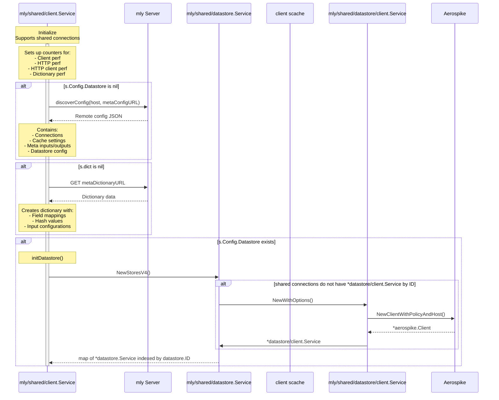
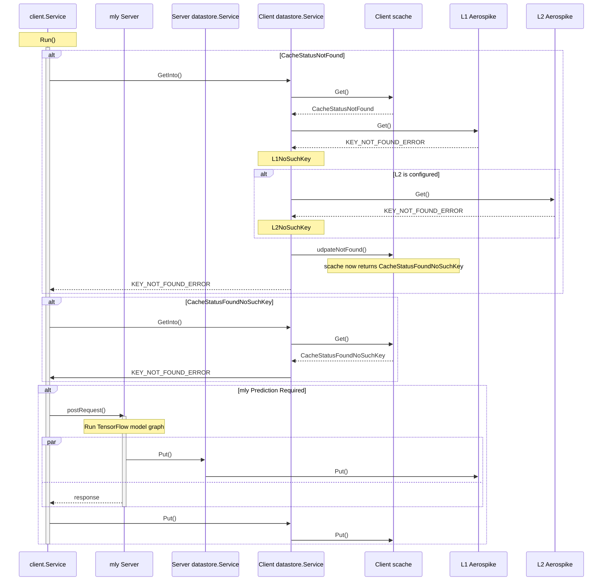
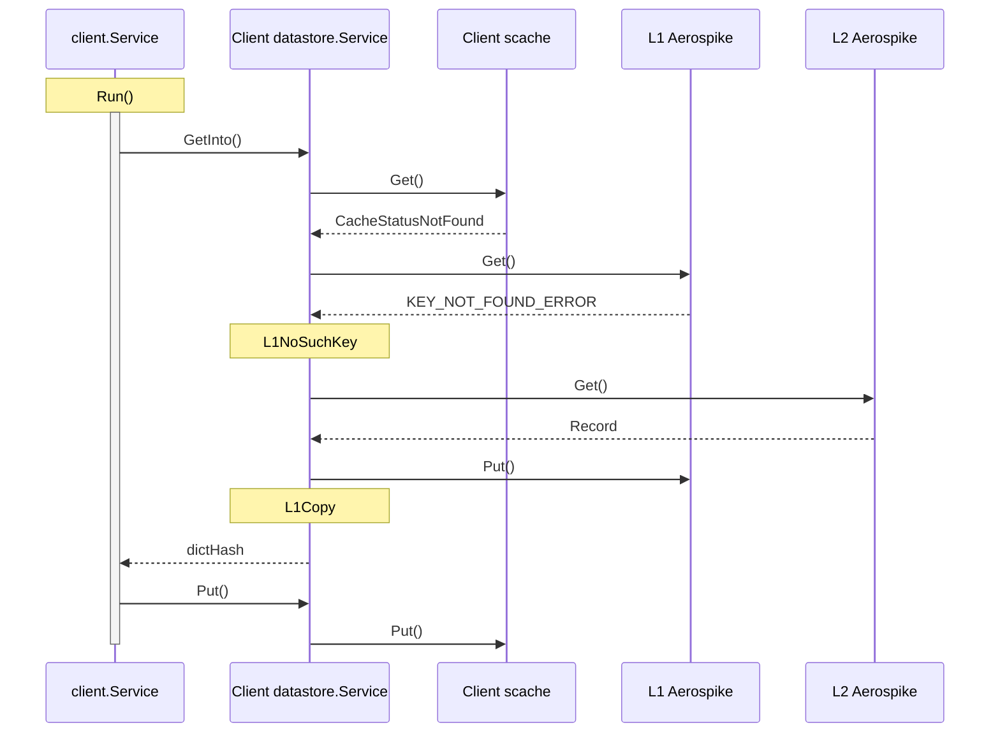

# Client Workflows

## Initialization

```mermaid
sequenceDiagram
    participant client as mly/shared/client.Service
    participant mlyserver as mly Server
    participant datastore as mly/shared/datastore.Service
    participant scache as client scache
    participant dscli as mly/shared/datastore/client.Service
    participant aerospike as Aerospike

    Note over client: Initialize<br/> Supports shared connections
    activate client

    Note over client: Sets up counters for:<br/>- Client perf<br/>- HTTP perf<br/>- HTTP client perf<br/>- Dictionary perf

    %% Config Discovery
    alt s.Config.Datastore is nil
        client->>mlyserver: discoverConfig(host, metaConfigURL)
        mlyserver-->>client: Remote config JSON
        Note over client: Contains:<br/>- Connections<br/>- Cache settings<br/>- Meta inputs/outputs<br/>- Datastore config
    end

    %% Dictionary Loading
    alt s.dict is nil
        client->>mlyserver: GET metaDictionaryURL
        mlyserver-->>client: Dictionary data
        Note over client: Creates dictionary with:<br/>- Field mappings<br/>- Hash values<br/>- Input configurations
    end

    %% Datastore Init
    alt s.Config.Datastore exists
        Note over client: initDatastore()
        client->>datastore: NewStoresV4()
        alt shared connections do not have *datastore/client.Service by ID
            datastore->>dscli: NewWithOptions()
            dscli->>aerospike: NewClientWithPolicyAndHost()
            aerospike-->>dscli: *aerospike.Client
            dscli->>datastore: *datastore/client.Service
        end
        datastore-->>client: map of *datastore.Service indexed by datastore.ID
    end

    deactivate client
```

# `Run()` Full Cache Miss

```mermaid
sequenceDiagram
    participant client as client.Service
    
    participant mlyserver as mly Server
    participant serverds as Server datastore.Service

    participant datastore as Client datastore.Service
    participant scache as Client scache

    participant aerospike as L1 Aerospike
    participant aerospikel2 as L2 Aerospike

    Note over client: Run()

    activate client

    alt CacheStatusNotFound
        client->>datastore: GetInto()
        datastore->>scache: Get()
        scache-->>datastore: CacheStatusNotFound

        datastore->>aerospike: Get()
        aerospike-->>datastore: KEY_NOT_FOUND_ERROR
        Note over datastore: L1NoSuchKey

        alt L2 is configured 
            datastore->>aerospikel2: Get()
            aerospikel2-->>datastore: KEY_NOT_FOUND_ERROR
            Note over datastore: L2NoSuchKey
        end

        datastore->>scache: udpateNotFound()
        Note over scache: scache now returns CacheStatusFoundNoSuchKey
        datastore-->>client: KEY_NOT_FOUND_ERROR
    end

    alt CacheStatusFoundNoSuchKey
        client->>datastore: GetInto()
        datastore->>scache: Get()
        scache-->>datastore: CacheStatusFoundNoSuchKey
        datastore->>client: KEY_NOT_FOUND_ERROR
    end

    alt mly Prediction Required
        client->>mlyserver: postRequest()
        
        activate mlyserver
        Note over mlyserver: Run TensorFlow model graph

        par 
            mlyserver->>serverds: Put()
            serverds->>aerospike: Put()
        and 
            mlyserver-->>client: response
        end

        deactivate mlyserver

        client->>datastore: Put()
        datastore->>scache: Put()
    end
    deactivate client
```

# `Run()` L1 Miss, L2 Hit

```mermaid
sequenceDiagram
    participant client as client.Service
    participant datastore as Client datastore.Service
    participant scache as Client scache
    participant aerospike as L1 Aerospike
    participant aerospikel2 as L2 Aerospike

    Note over client: Run()

    activate client

    client->>datastore: GetInto()
    datastore->>scache: Get()
    scache-->>datastore: CacheStatusNotFound

    datastore->>aerospike: Get()
    aerospike-->>datastore: KEY_NOT_FOUND_ERROR
    Note over datastore: L1NoSuchKey

    datastore->>aerospikel2: Get()
    aerospikel2-->>datastore: Record
    datastore->>aerospike: Put()
    Note over datastore: L1Copy
    datastore-->>client: dictHash

    client->>datastore: Put()
    datastore->>scache: Put()
    
    deactivate client
```